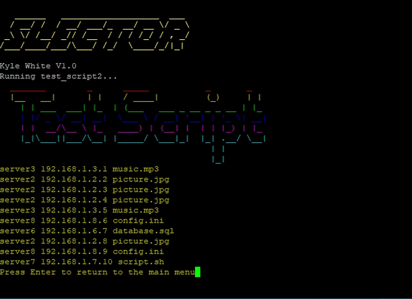

Use:
  Handy tool for technicians to run scripts and record the output. 
  Technicians may keep the info on the screen until they command the script to go back to the menu.
  Dynamically updates the menu each time a new script is put into the scripts directory
  Gives a command line interface to run .sh scripts from the scripts folder

 Instructions:
 
  Slector must reside in the same directory as the 'scripts' directory.
  
  Put your scripts in the scripts folder, execute the slector.sh script.
  
  Enter your selection (1,2,3,Q, etc..)
  
  Watch as your little scripts go!

